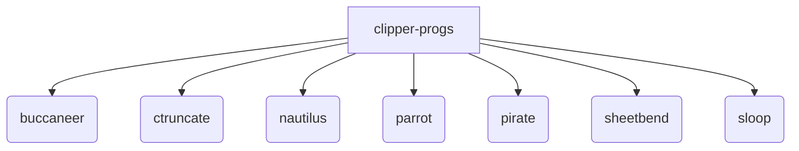

# clipper-progs
This repository contains the suite of clipper-based programs used within CCP4.

## Project Structure

## Building
### First Time
    git clone https://github.com/clipper-progs/clipper-progs.git
    cd clipper-progs
    git submodule update --init --recursive

### To get the latest changes
    git pull
    git submodule update --recursive
